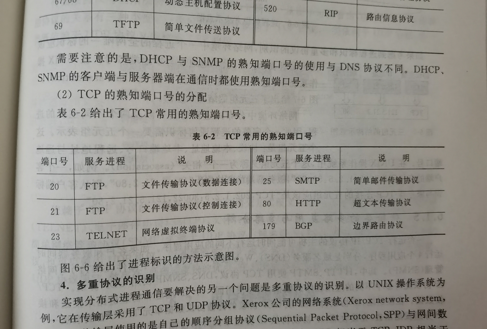
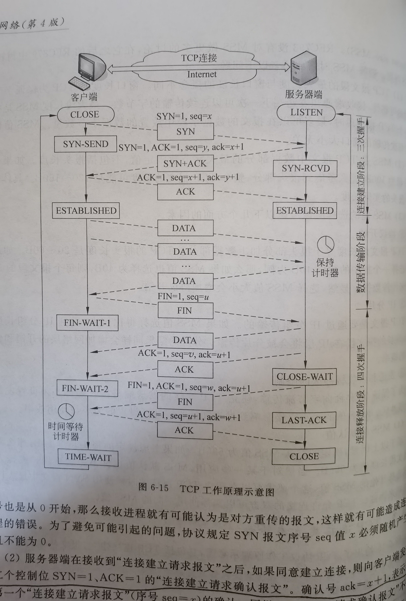

# 第六章 传输层
## 6.1 传输层以传输层协议
### 6.1.1 传输层的基本功能
- 传输层的主要功能是实现进程之间的端---端通信

理解传输层基本功能需要注意一下三个问题:
P293

### 6.1.2 传输协议数据单元的基本概念
不需要记,了解

### 6.1.3 应用进程,传输层接口与套接字
P295

### 6.1.4 网络环境中分布式进程标识方法
1. 进程表示的基本方法
tcp/udp规定用不同的端口号表示不同的应用程序
2. 端口号的分配方式
    - 熟知端口号:0~1023
    - 注册端口号:1024~49151
    - 临时端口号:49152~65536

3. 熟知端口号的分配方法

4. 多重协议的识别
- 三元组:协议类型,IP地址,端口号
- 五元组:协议,本地地址,本地端口号,远程地址和端口号

### 6.1.5 传输层的多路复用与多路分组

## 6.2 UDP协议
### 6.2.1 UDP协议的主要特点
UDP是一种无连接的,不可靠的传输层协议
- UDP协议在传输报文之前不需要再通信双方之间建立连接,因此减少了协议开销与传输延迟
- UDP将报文除了提供一种可选的校验和之外,几乎没有提供其他的保证数据传输可靠性的措施
- 如果UDP检测出在收到的分组出错,它就丢弃这个分组,既不确认,也不通知发送端和要求重传 

### 6.2.4 UDP协议适用的范围
- 视频播放应用
- 简短的交互式应用
- 多播与广播应用

UDP协议是一种使用于实时语音与视频传输的传输层协议

## 6.3 TCP协议
### 6.3.1 TCP协议的主要特点
- 支持面向连接的传输服务
- 支持字节流的传输
- 支持全双工通信
- 支持同时建立多喝并发的TCP连接
- 支持可靠的传输服务

### 6.3.3 TCP连接建立与释放
- TCP工作原理示意图
    
