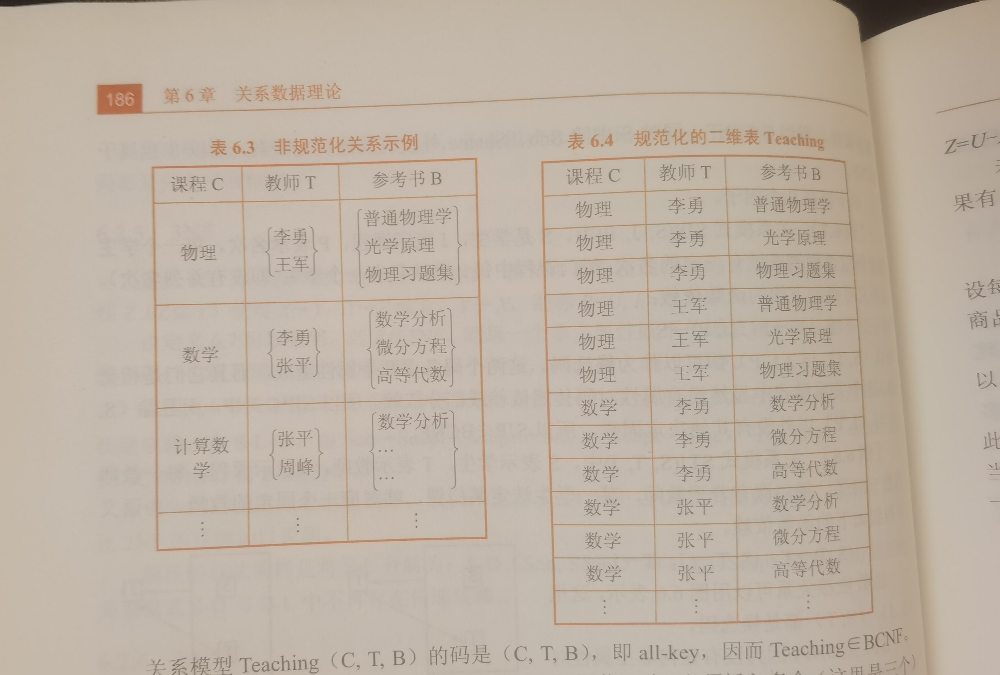

# 第五章 关系数据理论
## 5.1 问题的提出
### 关系数据可逻辑设计
- 针对具体问题,如何构造一个适合于他的数据模型
- 数据库

型与值(type/value):关系模式/关系,关系数据库模式/关系数据库  

### 关系模式的形式化定义  
关系模式有五部分组成,他是一个五元组:
R(U,D,DOM,F)
- R :关系名
- U:组成该关系的属性名的集合
- D:属性组U中属性所来之的域
- DOM:属性向域的映像集合
- F:属性组U上的一组依赖

### 什么是数据依赖
1. 完整性约束的表现形式
    - 限定属性的取值范围
    - 定义属性值间的相互关联,主要体现与值的相等与否,这就是数据依赖,他是数据库模式设计的关键
2. 数据依赖
    - 是通过一个关系中属性值之间的值的相等与否体现出来的数据间的相互关系
    - 是现实世界属性间相互联系的抽象
    - 是数据内在的性质
    - 是语义的体现(语义:商业逻辑)

### 数据依赖的类型
- 函数依赖
- 多值依赖
- 其他

### 关系模式的简化表示
- 关系模式R(U,D,DOM,F),简化为一个三元组:R(U,F)
- 当且仅当U上的一个关系r满足F是,r称为关系模式R(U,F)的一个关系

### 数据依赖对关系模式的影响
例子:描述学生数据库的例子  
学生的学号Sno,所在系Sdept,系主任姓名Mname,课程名Cname,成绩Grade 
单一的关系模式:  Student<U,F>  
U={Sno,Sdept,Mname,Cname,Grade}  

学校数据库的语义:  
1. 一个系有若干个学生,一个学生只属于一个系
2. 一个系只有一名主任
3. 一个学生可以选修多门课程,没门课程有若干学生选修
4. 每个学生所学的每门课程都有一个成绩

语义形式化:  
F={Sno->Sdept,Sdept->Mname,(Sno,Cname)->Grade}

关系模式Student<U,F>中存在的问题:  
1. 数据太冗余
    - 浪费大量的存储空间  
    例:每一个系主任的名字重复出现
2. 更新异常
    - 数据冗余,更新数据时,维护数据完整性代价大  
    例:某系更换系主任后,系统必须修改与该系学生有关的每一个元祖
3. 插入异常
    - 该插入的数据插不进去
4. 删除异常
    - 不该删除的数据不得不删

结论:要不会发生插入异常;删除异常;更新异常.最大程度减少数据冗余  
原因:由存在于模式中的某些数据依赖引起的  
解决方法:通过分解关系模式来消除其中不合适的数据依赖,one fact,one
place

## 5.2 规范化
规范化理论是用来改造关系模式,通过分解关系模式来消除其中不合适的数据依赖,以解决插入,删除,更新异常和数据冗余的问题
### 5.2.1 函数依赖
定义: 设R(U)是一个属性集U上的关系模式,X和Y是U的子集.若对于R(U)的任意一个可能得关系r,r中不可能存在两个元组在X上的属性值相等,二在Y上的属性值不想等,则称"X函数确定Y"或"Y函数依赖于X",记作X-->Y。  
X称为这个函数依赖的决定属性集(或决定因子)  
Y=f(X)  
说明:  
1. 函数依赖不是指关系模式R的某个或某些关系实例满足的约束条件,而是指R的**所有关系实例**均要满足的约束条件。
2. 函数依赖是**语义范畴**的概念,只能根据数据的语义来确定函数依赖。  
例如"姓名-->年龄"这个函数依赖只有在不允许有同名人的条件下成立。
3. 数据库设计者可以对现实世界做强制性的规定。

#### 平凡函数依赖与非平凡函数依赖  
在关系模式R(U)中,对于U的自己X和Y,  
如果X-->Y,但Y⊈X,则称X-->Y是非平凡的函数依赖  
如果X-->Y,但Y⊆X,则称X-->Y是平凡的函数依赖  
例子:在关系sc(Sno,Cno,Grade)中,  
非平凡函数依赖:(Sno,Cno)-->Grade  
平凡函数依赖:(Sno,Cno)-->Sno  
**对任一关系模式,平凡函数依赖都是必然成立的,他不反映新的语义,因此不特别声明,我们总是讨论非平凡的函数依赖**

#### 完全函数依赖与部分函数依赖  
定义:  
在关系模式R(U)中,如果X-->Y,并且对于X的任何一个真子集X',都有  
X'-\\->Y,则称Y完全依赖与X,记作X-f->Y。  
若X-->Y,但Y不完全函数依赖于X,则称Y部分函数依赖与X,记作X-p->Y。  

#### 传递函数依赖
定义:  
在关系模式R(U)中,如果x-->y,y-->z(都是非平凡的函数依赖),且y⊈x,y-/->,z⊈y,则称z传递函数依赖于x。  
注意:如果y-->x,即x<-->y,则z直接依赖于x。  
例子:  
在关系Std(Sno,Sdept,Mname)中,有:  
Sno-->Sdept,Sdept-->Mname  
Mname传递依赖于Sno

### 5.2.2 码
定义:设K是关系模式R<U,F>中的属性或属性组合。  
若K-f->U,则k称为R的一个候选码(Candidate Key)。  
若关系模式R有多个候选码,则选定其中一个作为主码(Primary Key)。 

主属性和非主属性:所有候选码中的属性都叫主属性  
ALL KEY:候选码是全体属性

#### 外部码
定义:关系模式R中属性或属性组X并非R的码,但X是另一个关系模式的码,则称X是R的外部码(在标的层次里,外码必须是主码)(Foreign Key)也称外码  
主码又和外部码一起提供了表示关系间联系的手段

### 5.2.3 范式(Normal Form)
范式是符合某一个级别的关系模式的集合。  
关系数据库中的关系必须满足一定的需求。满足不同程度要求的为不同范式。  
范式的种类:  
{  
第一范式(1NF)  
第二范式(2NF)  
第三范式(3NF)  
BC范式(修正的第三范式)(BCNF)  
第四范式(4NF)  
第五范式(5NF)  
}
各范式之间存在联系:  
1NF⊃2NF...⊃5NF  
某一关系模式R为第N范式,可简记为R∈xNF  

### 5.2.4 2NF
1NF的定义:如果一个关系模式R的所有属性都是**不可分的基本数据项**,则R∈1NF。  
第一范式是对关系模式的最起码得要求。不满足第一范式的数据库模式不能称为关系数据库。  
但是满足第一范式的关系模式并不一定是好的关系模式。  

例子:关系模式SLC(Sno,Sdept,Sloc,Cno,Grade)Sloc为学生住宿,假设每个系的学生住在同一个地方。  
函数依赖包括:  
(Sno,Cno)-f->Grade  
Sno-->Sdept  
(Sno,Cno)-p->Sdept  
Sno-->Sloc  
(Sno,Cno)-p->Sloc  
Sdept-->Sloc

SLC的码为(Sno,Cno)  
SLC满足第一范式  
非主属性Sdept和Sloc部分函数依赖于码(Sno,Cno)。  

SLC不是一个好的关系模式:  
1. 插入异常
2. 删除异常
3. 数据冗余度大  
4. 修改复杂  

原因:  
Sdept,Sloc部分函数依赖于码。  
解决方法:  
SLC分解为两个关系模式,以消除这些部分函数依赖  
SC(Sno,Cno,Grade)  
SL(Sno,Sdept,Sloc)

#### 2NF
定义:若关系模式R∈1NF,并且每一个**非**主属性都**完全**依赖于R的码,则称R∈2NF。

### 5.2.5 3NF
例子:  
2NF关系模式SL(Sno,Sdept,Sloc)中  
函数依赖:  
Sno-->Sdept  
Sdept-->Sloc  
Sno-->Sloc  
Sloc传递函数依赖于Sno,即SL中存在非主属性对码的传递函数依赖。  

解决办法:  
采用投影法分解,把SL分解为两个关系模式,以消除传递函数依赖:  
SD(Sno,Sdept)  
DL(Sdept,Sloc)  
SD的码为Sno,DL的码为Sdept  

#### 3NF
在2NF的基础上消除了非主属性对码的传递函数依赖。

## 5.2.6 BC范式(BCNF)
定义:设关系模式R<U,F>属于1NF,如果对于R的每个函数依赖X-->Y,Y不属于X,则X必含候选码,那么R属于BCNF  
若R属于BCNF:  
- 每一个决定属性集(因素)都包含(候选)码
- R中的所有属性集(主,非主属性)都完全函数依赖于码
- R属于3NF(证明)
- 若R属于3NF,则R不一定属于BCNF

例子:  

### BCNF的关系模式所具有的性质
1. 所有非主属性都完全函数依赖于每个候选码
2. 所有主属性都完全函数依赖于每个不包含它的候选码
3. 没有任何属性完全函数依赖于非码的任何一组属性(排除了传递依赖)

## 5.2.7 多值依赖与第四范式

- Teaching属于BCNF
- Teach具有唯一候选码(C,T,B),即全码
- Teaching模式中存在的问题

    1. 数据冗余度大
    2. 插入异常
    3. 删除异常
    4. 更新异常

原因:存在多值依赖

### 多值依赖
定义:  
设R(U)是一个属性集U上的一个关系模式,X,Y,和Z是U的子集,并且Z=U-X-Y,多值依赖X-->-->Y成立当且仅当对R的任一关系r,r在(X,Z)上的每个值对应一组Y的值,这组值仅仅决定于X值而与Z值无关

